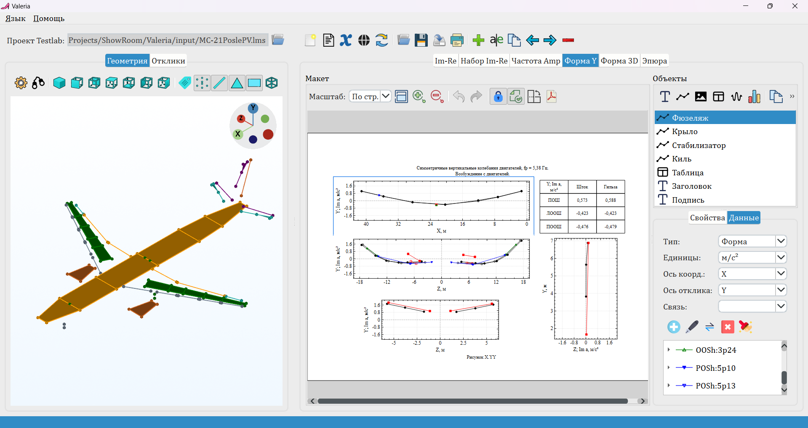
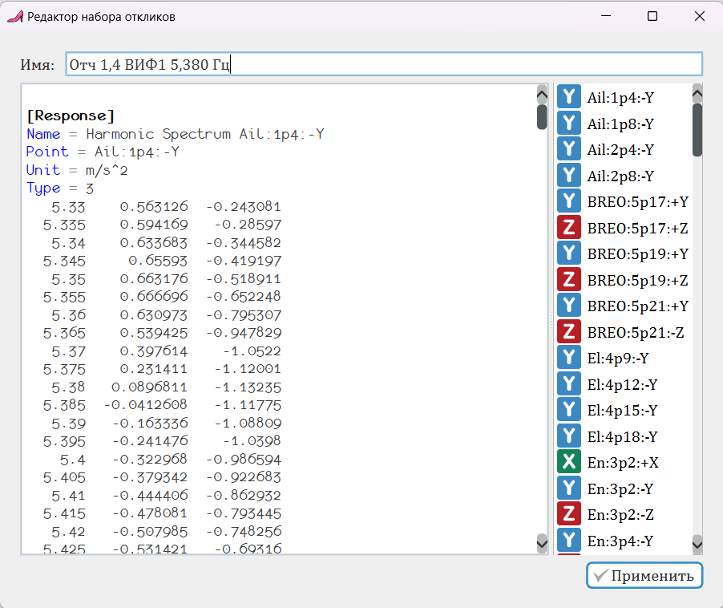

Программа `Valeria` предназначена для автоматического генерирования отчётов по результатам модальных испытаний. Для получения записанных откликов программа взаимодействует с программным интерфейсом `LMS TestLab Automation`.

Пользователь задает постраничную разметку страниц, создавая графические элементы следующих видов:
* текст;
* график;
* таблицу;
* эпюру;
* изображение. 

После создания элементов возможно редактирование их свойств и назначение точек конструкции для получения измерительных данных. При этом программа позволяет создавать макросы, которые могут быть использованы в любом из полей этих элементов. Результирующая разметка страниц сохраняется в виде `JSON` файла и может быть использована в дальнейшем как для этой конструкции, так и для конструкции схожей компановки.

Кроме того, в случае, если данные записаны с использованием измерительной системы, несовместимой с `LMS Testlab`, загрузка данных может быть произведена с помощью редактора откликов. Для навигации в редакторе откликов используются закладки, связанные с каждым из сигналов.

